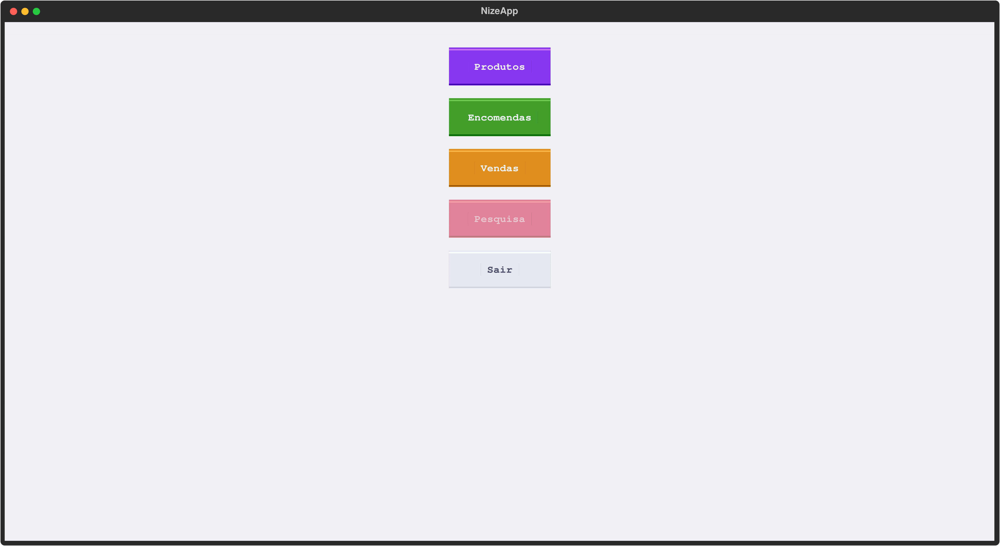
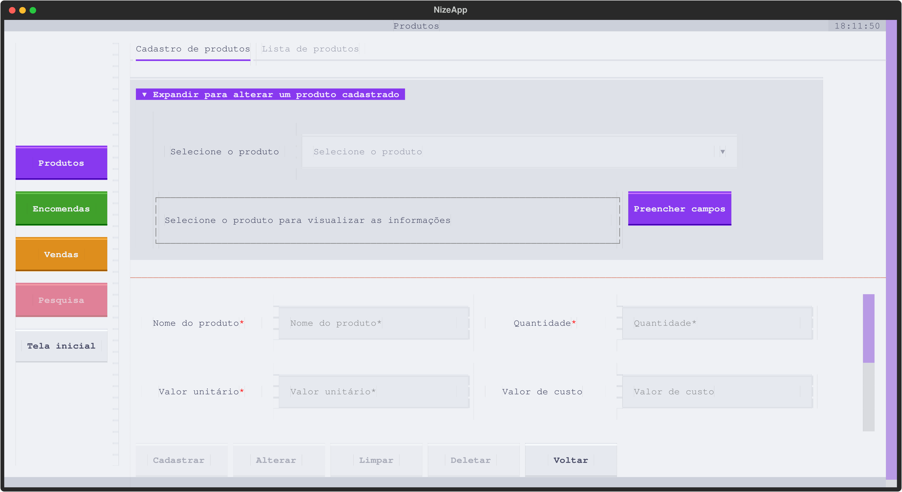
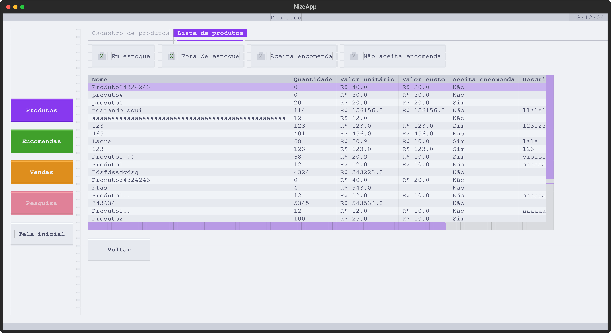
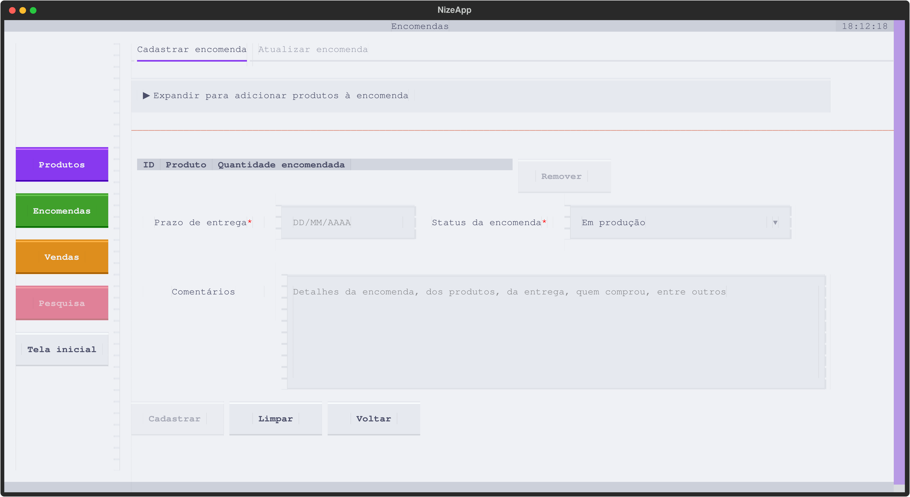
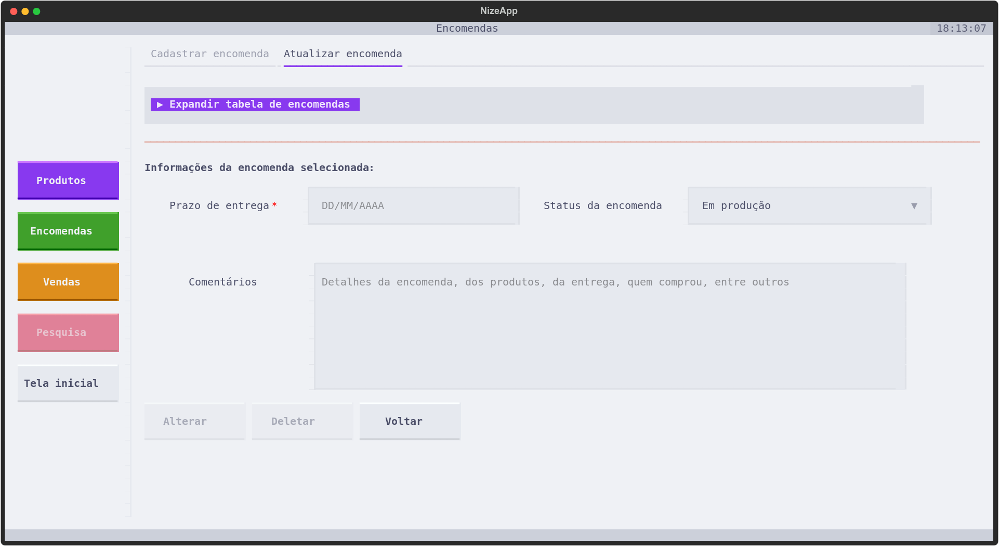
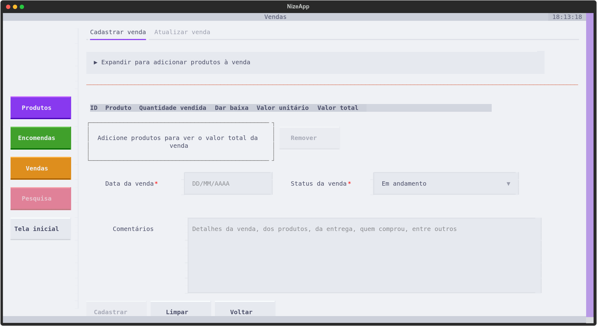
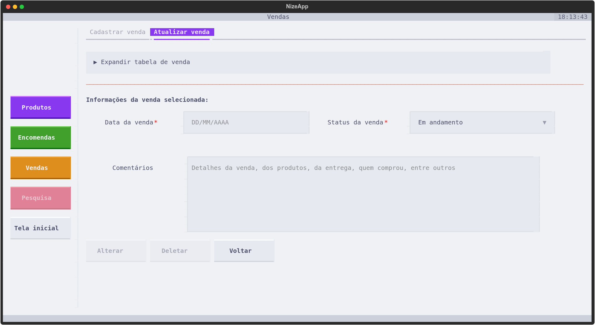

# Sistema para vendedores autônomos (Python, SQLite)

O Nize é um software (atualmente desktop) destinado para vendedores autônomos. Ele permite o registro de produtos, encomendas e vendas, com CRUD completo das funcionalidades.

Desenvolvido com Python, SQLite e Textual, o sistema roda no terminal.

O sistema segue em desenvolvimento. Para as próximas etapas, está previsto:
- Possibilidade de pesquisa (atualmente desabilitado);
- Possibilidade de inserção de imagem dos produtos;
- Modificações para uma versão web.

## Tela inicial

> A tela inicial do sistema mostra os botões para outras telas (Produtos, Encomendas, Vendas, Pesquisa) e o botão para sair.

## Tela de produtos
### Tela de cadastro e atualização de produtos

### Tela de lista de produtos

## Tela de encomendas
### Tela de cadastro de encomendas

### Tela de atualização de encomendas

## Tela de vendas
### Tela de cadastro de venda

### Tela de atualização de venda

