# Sistema para vendedores autônomos (Python, SQLite)

O Nize é um software (atualmente desktop) destinado para vendedores autônomos. Ele permite o registro de produtos, encomendas e vendas, com CRUD completo das funcionalidades.

Desenvolvido com Python, SQLite e Textual, o sistema roda no terminal.

O sistema segue em desenvolvimento. Para as próximas etapas, está previsto:
- Possibilidade de pesquisa (atualmente desabilitado);
- Possibilidade de inserção de imagem dos produtos;
- Modificações para uma versão web.

## Tela inicial

> A tela inicial do sistema mostra os botões para outras telas (Produtos, Encomendas, Vendas, Pesquisa) e o botão para sair.

## Tela de produtos
### Tela de cadastro e atualização de produtos

> Tela de cadastro de produtos. Ao preencher os dados obrigatórios (nome do produto, quantidade e valor unitário), é liberado o botão de "cadastrar". O botão de "limpar" serve para limpar os campos preenchidos. Na parte superior, é possível expandir para ver a lista de produtos cadastrados e fazer alterações.

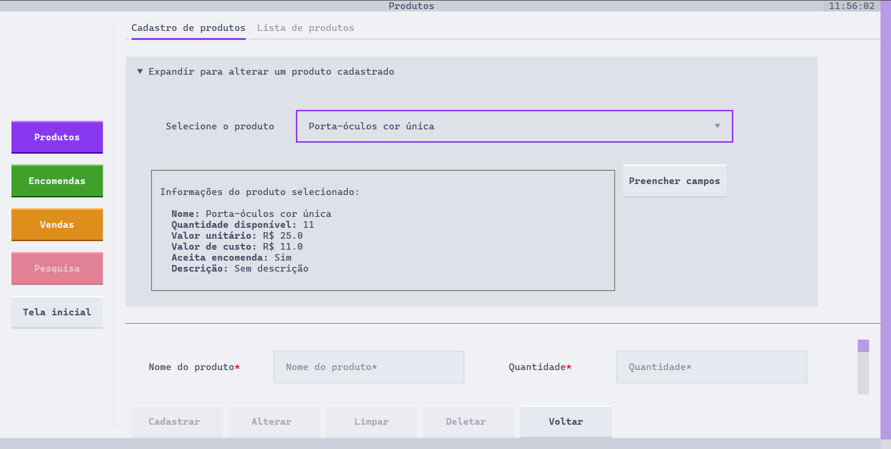

> Ao ser expandida, a parte de seleção de produtos aparece. Nela, é possível ver uma lista de produtos cadastrados e selecionar um deles. Ao ser selecionado, as informações dele aparecerão. Ao clicar em "Preencher dados", os campos serão preenchidos com as informações cadastradas do produto. Isso fará a liberação do botão "Alterar", que permite fazer alterações nos dados do produto.

### Tela de lista de produtos

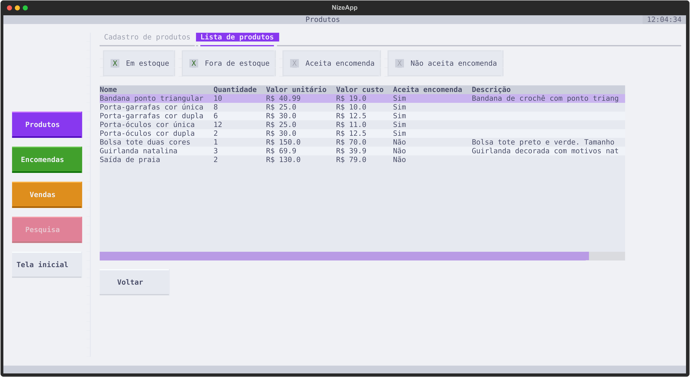

> A tela de Lista de produtos exibe uma tabela com todos os produtos cadastrados e suas informações. 

## Tela de encomendas
### Tela de cadastro de encomendas

> Assim como a tela de cadastro de produtos, a tela de cadastro de encomendas inicia com a parte superior fechada. Para criar uma encomenda, é necessário expandir a parte superior.

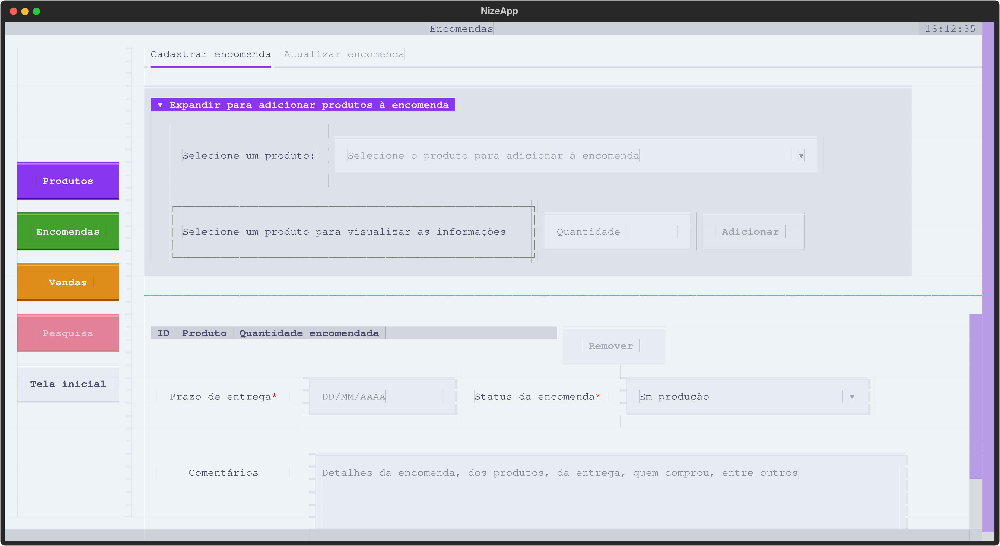

> Com a parte superior expandida, é possível selecionar um produto cadastrado. Ao selecionar um produto, as informações dele aparecerão. 

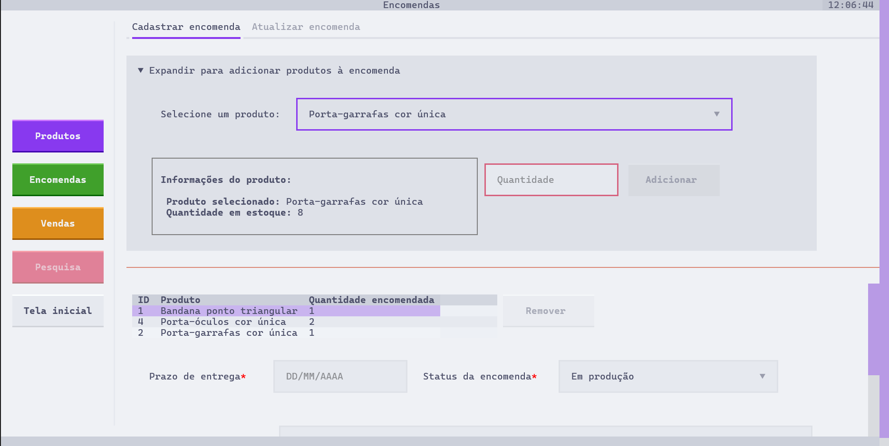

> Após adicionar uma quantidade e clicar no botão de "Adicionar", os produtos serão inseridos na tabela de encomendas (abaixo). É possível selecionar um produto na tabela e clicar em "Remover" para retirar ele da encomenda. Após inserir os dados obrigatórios (Prazo de entrega e status), o botão de "Cadastrar" será liberado.

> IMPORTANTE: nesta tela, aparecem apenas produtos que foram cadastrados como "Aceita encomendas".

### Tela de atualização de encomendas

> A tela de atualização de encomendas também necessita da expansão do bloco para visualizar a tabela de encomendas.

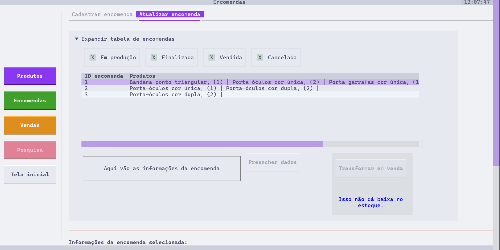
> Após expandir, uma tabela de encomendas será mostrada. A tabela tem filtros por status (Em produção, Finalizada, Vendida e Cancelada). 

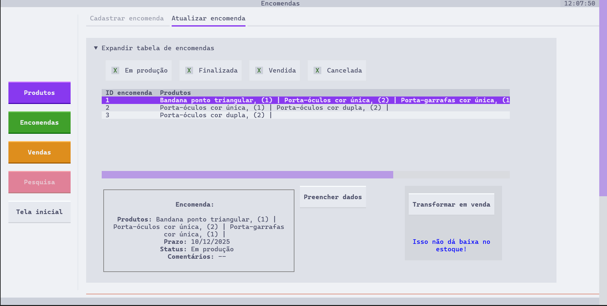

> Ao selecionar uma encomenda na tabela, as informações dela serão preenchidas abaixo e o botão "Preencher dados" será liberado. Ao clicar neste botão, as informações serão preenchidas para fazer alterações na encomenda. Ao lado, o botão "Transformar em venda" permite que uma encomenda seja automaticamente transformada em venda. 

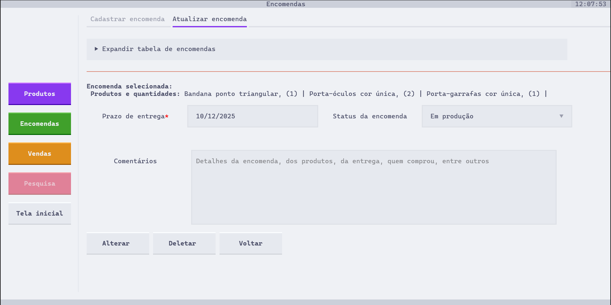

> Ao preencher os dados, a parte superior será automaticamente fechada. As informações sobre a encomenda aparecerão em forma de texto na parte inferior, com o Prazo, Status e Comentários preenchidos nos devidos campos.

> IMPORTANTE: 
> - o botão de "Transformar em venda" não dá baixa dos produtos no estoque; 
> - as alterações possíveis de serem feitas em uma encomenda são: prazo, status e comentários.

## Tela de vendas
### Tela de cadastro de venda

> A tela de cadastro de vendas e encomendas é semelhante. É necessário expandir a parte superior para adicionar produtos à uma venda.

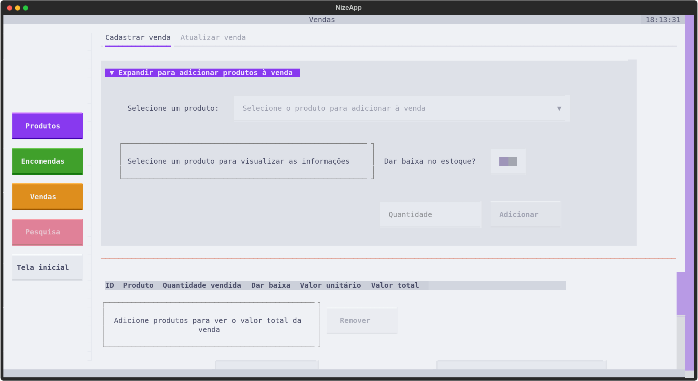

> Ao expandir o bloco, é possível selecionar um produto e ver suas informações. Há um seletor de "dar baixa do estoque", que, ao ser ativado, dará baixa dos produtos no estoque. 

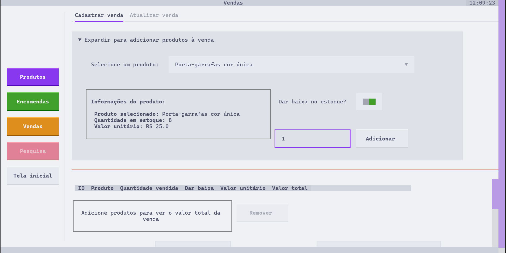

> Ao adicionar a quantidade, o botão de "Adicionar" será liberado."

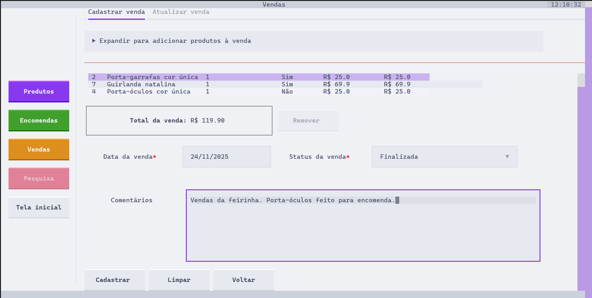

> Após isso, os produtos serão adicionados à tabela de vendas. Se um produto for selecionado na tabela, ele poderá ser removido da venda. É possível visualizar o valor total da venda. Após adicionar a data da venda, será possível realizar o cadastro.

### Tela de atualização de venda

> A tela de atualização de venda também inicia com o bloco fechado. Para fazer alterações, é necessário expandir o bloco.

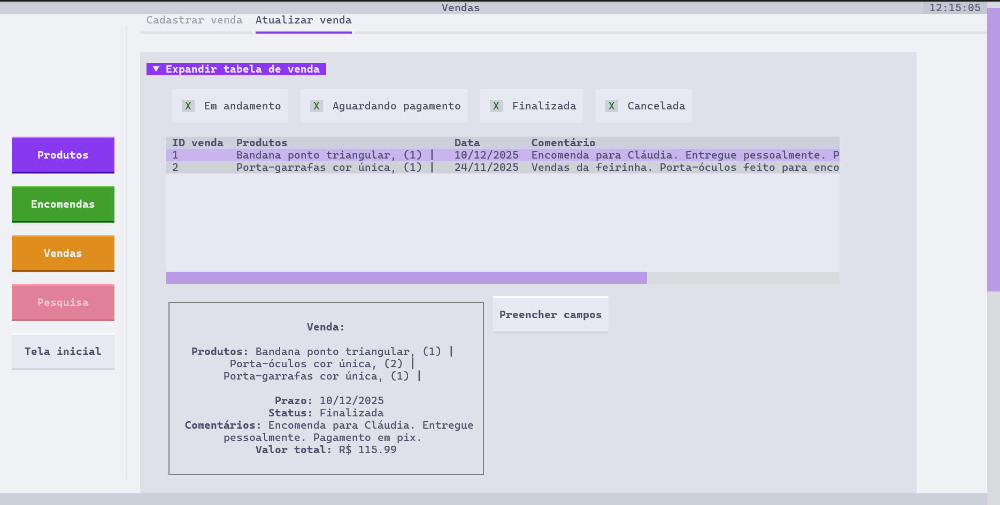

> O bloco tem uma tabela com todas as vendas cadastradas. Ao selecionar uma venda, será possível visualizar as informações dela. Ao clicar em "Preencher dados", será possível fazer atualizações na venda.

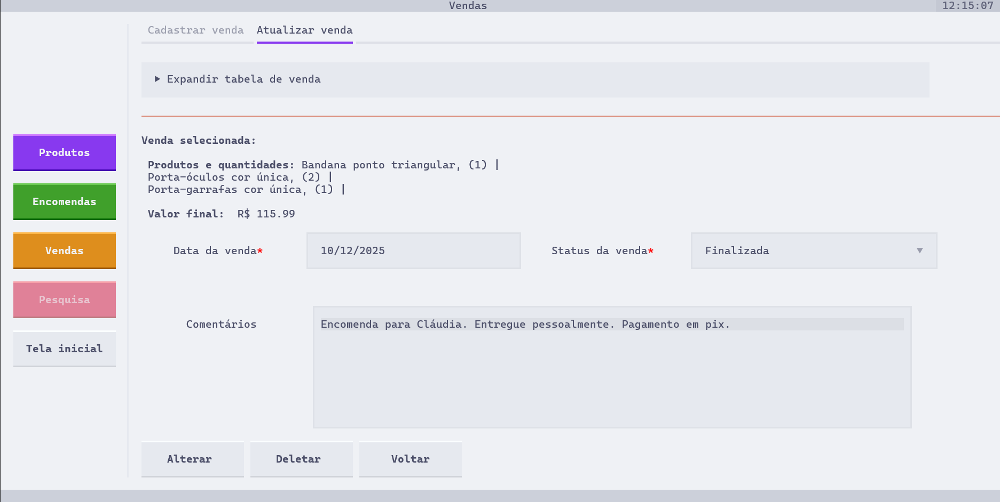

> Ao clicar em "Preencher dados", a parte superior será fechada. As informações da venda serão preenchidas em forma de texto na parte inferior, e as informações de Prazo, Status e Comentários serão preenchidas nos devidos campos.

> IMPORTANTE: as alterações possíveis de serem feitas em uma venda são: data, status e comentários.

